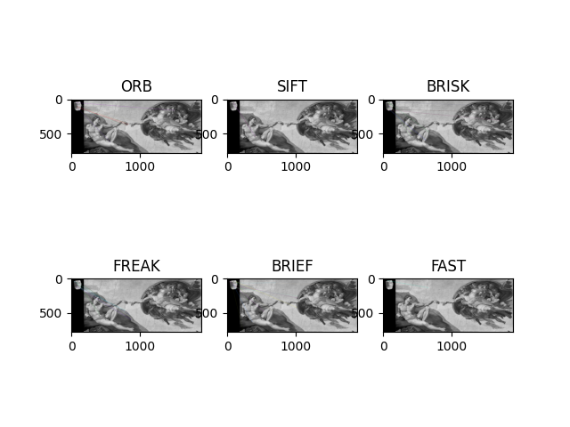

# TP3 Traitement d'image [LEBORGNE-SEBIROT]

## Exercice 1

Après recherche et expérimenation nous avons conclus que :

1. **SIFT (Scale-Invariant Feature Transform):**

   * Points forts :
     * Invariant par rapport à l'échelle, la rotation et la translation.
     * Robuste aux changements d'éclairage et aux variations de point de vue.
   * Points faibles :
     * Plus lent que certains autres détecteurs et descripteurs.
2. **SURF (Speeded-Up Robust Features):**

   * Points forts :
     * Invariant par rapport à l'échelle et partiellement invariant par rapport à la rotation.
     * Plus rapide que SIFT.
   * Points faibles :
     * Non libre de droits dans certaines applications.
3. **FAST (Features from Accelerated Segment Test):**

   * Points forts :
     * Très rapide.
     * Bon pour les applications temps réel.
   * Points faibles :
     * Moins robuste aux variations d'échelle et de rotation.
4. **ORB (Oriented FAST and Rotated BRIEF):**

   * Points forts :

     * Combinaison de FAST et BRIEF.
     * Open source et rapide.
   * Points faibles :

     * Moins robuste que SIFT et SURF dans certaines situations.
5. **BRIEF:**

   * **Points forts :**
     * Basé sur la binarisation des patchs d'images.
     * Très rapide, car il ne génère que des descripteurs binaires.
     * Peut être utilisé avec différents détecteurs de points d'intérêt.
   * **Points faibles :**
     * Non invariant par rapport à l'échelle et à la rotation.
     * Sensible au bruit.
6. **BRISK:**

   * **Points forts :**
     * Conçu pour être rapide et robuste.
     * Utilise des échelles octagonales pour la détection de points.
     * Utilise un descripteur BRIEF pour la correspondance.
   * **Points faibles :**
     * La rapidité peut entraîner une perte de précision par rapport à des méthodes plus lentes.

   On remarque d'ailleur dans la figure ci-dessous que les meilleur matchs sont fait à l'aide de SIFT et BRISK :

   

## Excercice 2

#### 2.1

Le nombre minimum d'associations (K) nécessaire dépend du type de transformation que vous souhaitez estimer. Pour une transformation affine 2D (translation, rotation, mise à l'échelle), il est généralement accepté que trois correspondances sont nécessaires.

* **Translation :** Une seule correspondance est suffisante pour estimer une translation.
* **Rotation :** Deux correspondances sont nécessaires pour estimer une rotation.
* **Mise à l'échelle :** Deux correspondances supplémentaires sont nécessaires pour estimer la mise à l'échelle.

Ainsi, pour une transformation affine 2D (translation, rotation, mise à l'échelle), K = 3 est le nombre minimum d'associations nécessaire pour calculer une paramétrisation (x, y, θ).

Pour utiliser le script générant les fichier de solutions lancé la commande : `python3 tp3_2.py `

## Exercice 3

#### Michalangelo

Resultat de la recontruction :


Notation de la reconstruction à partir du mini projet du tp1 :

```
surface totale des fragments de la fresque : 1.36876e+06
Surface totale des fragments bien localisés : 513376
Surface totale des fragments n'appertenant pas à la fresque : 0
Précision de localisation (p) : 0.375066
```

#### Domenichino

Resultat de la recontruction :


### Exercice 4

---

1. **Calcul des distances euclidiennes :** Pour chaque paire d'associations candidates, calculez la distance euclidienne entre les points d'intérêt correspondants dans les deux images.
2. **Définition d'un seuil :** Fixez un seuil de distance euclidienne au-delà duquel une association est considérée comme incorrecte.
3. **Filtrage :** Filtrer les associations en éliminant celles dont la distance euclidienne dépasse le seuil défini. Conservez uniquement les associations qui respectent la propriété de conservation de la distance.

**Avantages :**

* **Simplicité :** Cette stratégie est simple à mettre en œuvre et ne nécessite pas de processus itératif comme RANSAC.
* **Efficacité :** Si les transformations préservent réellement les distances euclidiennes, cette stratégie peut être très efficace pour éliminer les associations incorrectes.

**Inconvénients :**

* **Sensibilité au Seuil :** Le choix du seuil est critique. Un seuil trop strict risque de supprimer des associations correctes, tandis qu'un seuil trop large risque de laisser passer des associations incorrectes.
* **Dépendance aux Transformations :** Cette stratégie fonctionne bien uniquement si les transformations entre les images préservent effectivement les distances euclidiennes. Si les transformations impliquent des déformations complexes, cette stratégie peut échouer.

  resulat reconstruction par cette méthode :

  

  note reconstruction par cette methode :

  ```
  Surface totale des fragments de la fresque : 1.75517e+06
  Surface totale des fragments bien localisés : 335190
  Surface totale des fragments n'appertenant pas à la fresque : 0
  Précision de localisation (p) : 0.190973
  ```
